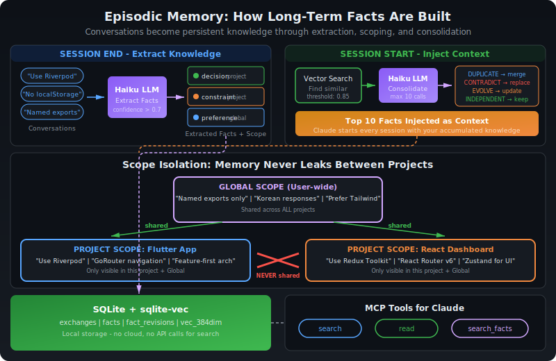
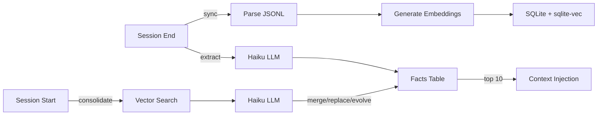
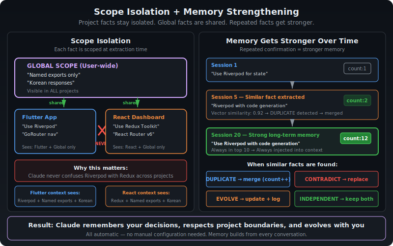
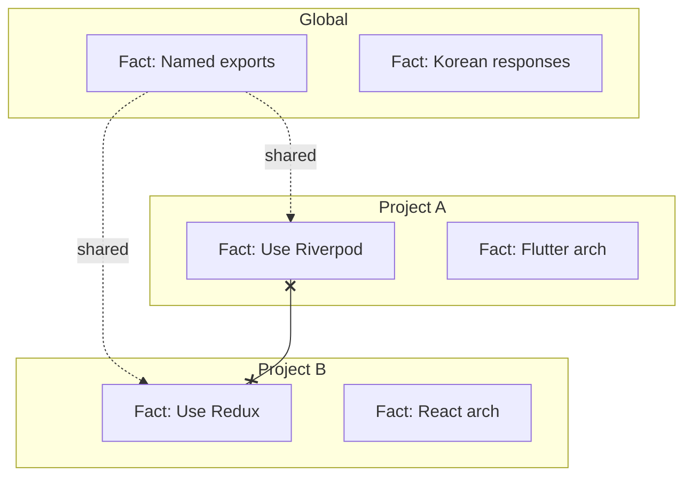
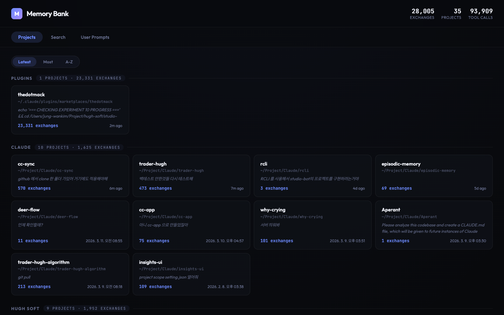

# Memory Bank

> Semantic search + fact extraction for Claude Code conversations.




## Features

- **Conversation Search** -- Semantic vector search across all past conversations
- **Fact Extraction** -- Automatic extraction of decisions, preferences, patterns from conversations
- **Fact Consolidation** -- Duplicate detection, contradiction handling, evolution tracking
- **Scope Isolation** -- Project facts stay in their project, global facts are shared
- **MCP Integration** -- `search`, `read`, and `search_facts` tools for Claude
- **Web UI** -- Dark-theme web interface for browsing and searching conversations

## How It Works



## Install

In Claude Code:
```
/plugin marketplace add https://github.com/jung-wan-kim/memory-bank
/plugin install memory-bank
```

## Quick Start

```bash
memory-bank sync      # Sync & index conversations
memory-bank search "React auth"  # Semantic search
memory-bank stats     # Index statistics
```

## Fact System

Facts are automatically extracted at session end and consolidated at session start.

| Category | Example |
|----------|---------|
| `decision` | "Using Riverpod for state management" |
| `preference` | "Named exports only" |
| `pattern` | "Bug-fixer retries 3 times on error" |
| `knowledge` | "API endpoints at /api/v2/" |
| `constraint` | "No localStorage usage" |

### Consolidation Rules



| Relation | Action |
|----------|--------|
| DUPLICATE | Merge (count++) |
| CONTRADICTION | Replace old + revision history |
| EVOLUTION | Update + revision history |
| INDEPENDENT | Keep both |

### Scope Isolation



Project A sees: Project A facts + Global facts (never Project B).

## MCP Tools

| Tool | Description |
|------|-------------|
| `search` | Semantic/text search across conversations |
| `read` | Display full conversation from JSONL |
| `search_facts` | Query extracted facts with category filter |

### search_facts example

```json
{
  "query": "state management",
  "category": "decision",
  "include_revisions": true,
  "limit": 10
}
```

## Web UI

A cinematic dark-theme web interface for browsing and searching your conversation history.



### Features

- **Projects View** -- Browse all projects grouped by category, sorted by latest/most/A-Z
- **Search** -- Full-text search across all conversations
- **User Prompts** -- Browse and search only user messages
- **Exchange Detail** -- View full user/assistant messages with tool call history

### Run

```bash
node ui/server.cjs
# Memory Bank UI: http://localhost:3847
```

Custom port:
```bash
PORT=8080 node ui/server.cjs
```

> **Note:** Requires `memory-bank sync` to have been run at least once to populate the database.

## Claude Desktop Integration

Share Claude Code's memory with Claude Desktop by adding the MCP server:

Edit `~/Library/Application Support/Claude/claude_desktop_config.json` (macOS):

```json
{
  "mcpServers": {
    "memory-bank": {
      "command": "node",
      "args": ["/path/to/memory-bank/cli/mcp-server-wrapper.js"]
    }
  }
}
```

Replace `/path/to/memory-bank` with the actual plugin path (check `~/.claude/plugins/`).

Claude Desktop will then have access to all your Claude Code conversations and extracted facts via the same `search`, `read`, and `search_facts` tools.

## Configuration

```bash
# Fact extraction model (default: claude-haiku-4-5-20251001)
export MEMORY_BANK_FACT_MODEL=claude-haiku-4-5-20251001
export ANTHROPIC_API_KEY=your-key

# Summarization model
export MEMORY_BANK_API_MODEL=opus
```

## Architecture

```
~/.config/superpowers/
├── conversation-archive/    # Archived JSONL files
└── conversation-index/
    └── db.sqlite            # SQLite + sqlite-vec
        ├── exchanges        # Conversation data + embeddings
        ├── facts            # Extracted facts + embeddings
        ├── fact_revisions   # Change history
        ├── vec_exchanges    # Vector index (384-dim)
        └── vec_facts        # Vector index (384-dim)
```

## Development

```bash
npm install && npm test && npm run build
```

## License

MIT
